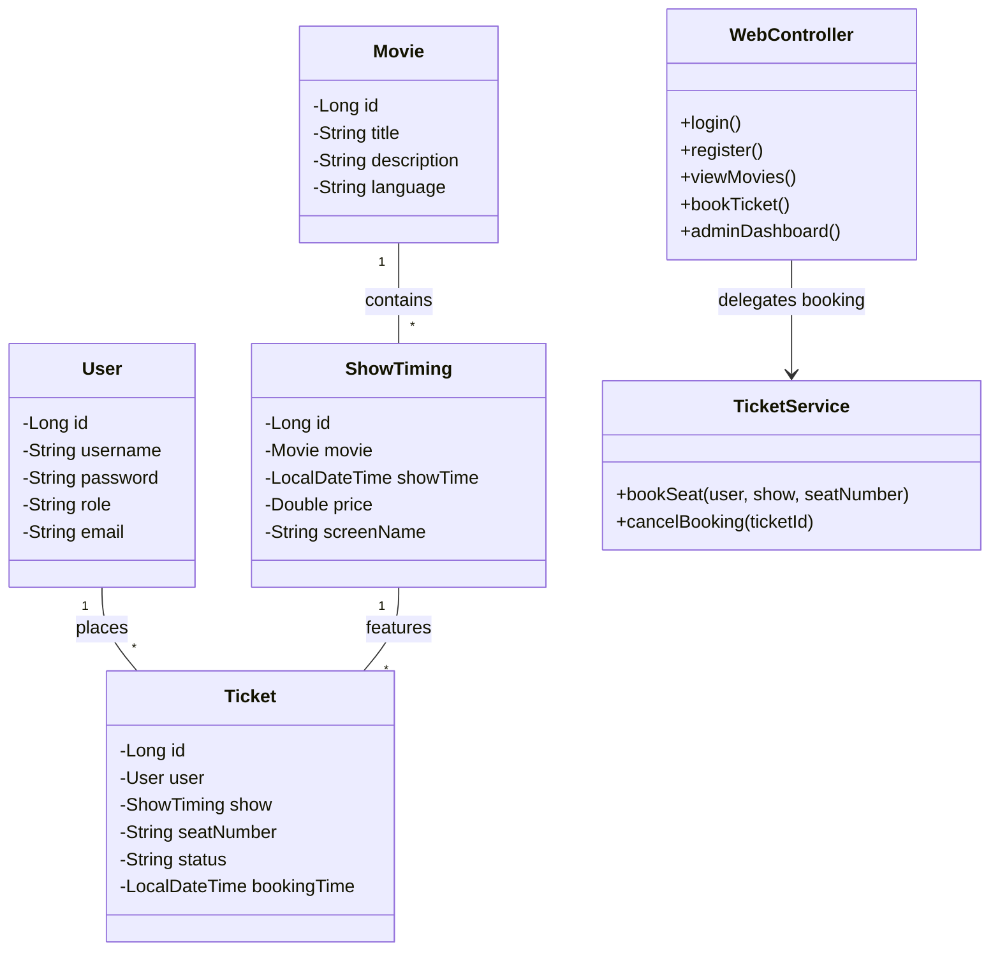

# Class Diagram

```mermaid
classDiagram
    class User {
        -Long id
        -String username
        -String password
        -String role
        -String email
    }
    class Movie {
        -Long id
        -String title
        -String description
        -String language
    }
    class ShowTiming {
        -Long id
        -Movie movie
        -LocalDateTime showTime
        -Double price
        -String screenName
    }
    class Ticket {
        -Long id
        -User user
        -ShowTiming show
        -String seatNumber
        -String status
        -LocalDateTime bookingTime
    }
    
    class WebController {
        +login()
        +register()
        +viewMovies()
        +bookTicket()
        +adminDashboard()
    }
    
    class TicketService {
        +bookSeat(user, show, seatNumber)
        +cancelBooking(ticketId)
    }

    User "1" -- "*" Ticket : places
    Movie "1" -- "*" ShowTiming : contains
    ShowTiming "1" -- "*" Ticket : features
    WebController --> TicketService : delegates booking
```
