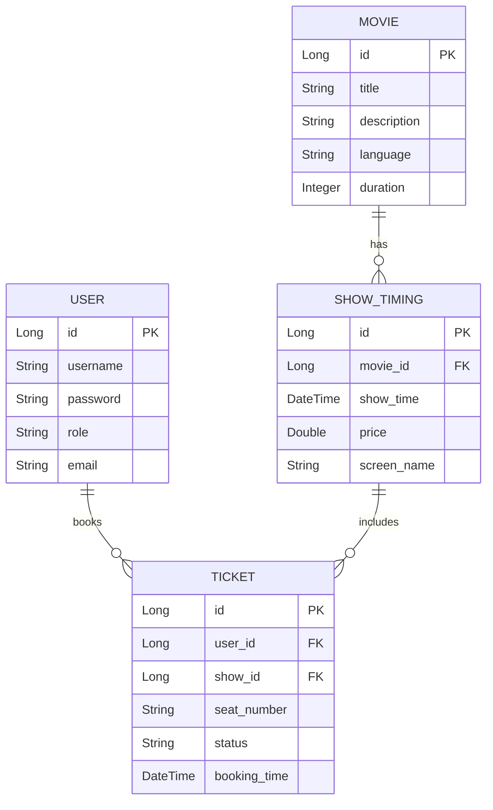

# Entity-Relationship Diagram

```mermaid
erDiagram
    USER {
        Long id PK
        String username
        String password
        String role
        String email
    }
    MOVIE {
        Long id PK
        String title
        String description
        String language
        Integer duration
    }
    SHOW_TIMING {
        Long id PK
        Long movie_id FK
        DateTime show_time
        Double price
        String screen_name
    }
    TICKET {
        Long id PK
        Long user_id FK
        Long show_id FK
        String seat_number
        String status
        DateTime booking_time
    }

    USER ||--o{ TICKET : books
    MOVIE ||--o{ SHOW_TIMING : has
    SHOW_TIMING ||--o{ TICKET : includes
```
